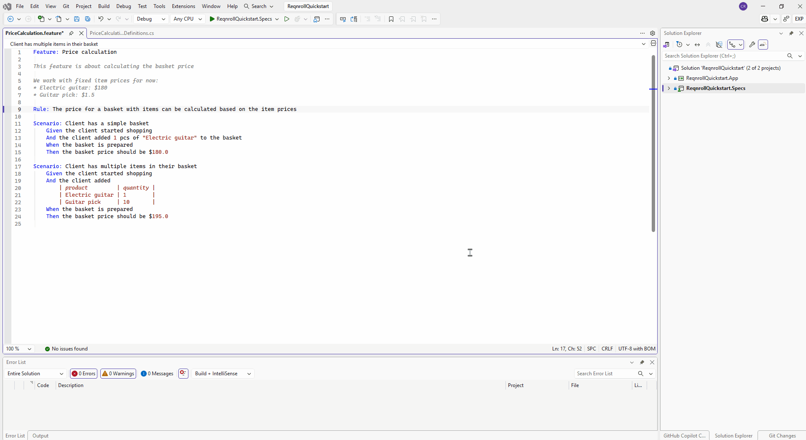
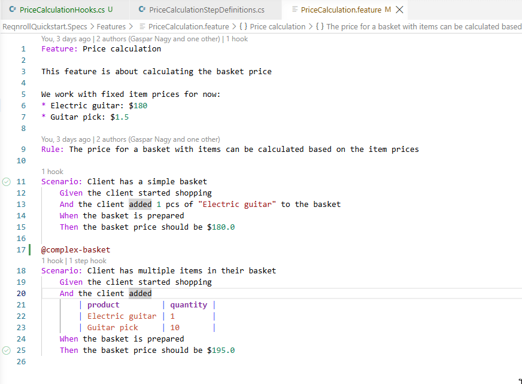

# Code Folding

Scenarios, Backgrounds, Rules, doc strings, and data tables can each be
collapsed in the editor gutter, the same way you'd fold a method body in
C#. Folding regions update automatically as you edit the document.

:::{tab-set}

```{tab-item} Visual Studio
:sync: vs


```

```{tab-item} VS Code
:sync: vscode



```

```{tab-item} Rider
:sync: rider

TODO(media): 📷 screenshot — the same, in Rider.
**Target:** `code-folding/code-folding-rider.png`
```

:::
