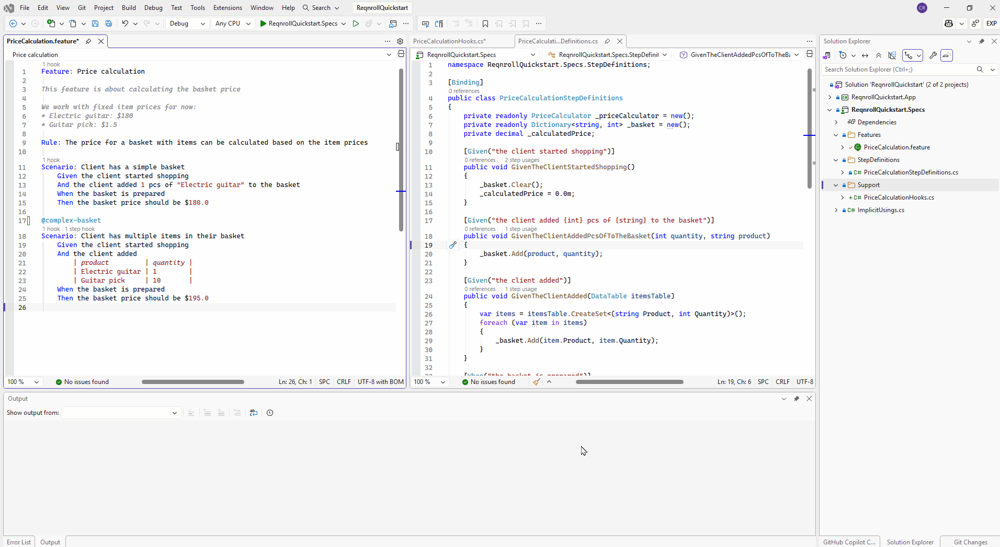

# Code Lens — Step & Hook Usage Counts

Three related CodeLens annotations show live binding match counts inline, above the
relevant line, without needing to run Find Usages manually:

## Step usage counts (C# side)

Each C# step binding method (`[Given]`/`[When]`/`[Then]`) shows an inline
annotation above its attribute reporting how many `.feature` steps
currently match it (e.g. "3 usages"). Clicking it opens the same results as
[Find Step Definition Usages](../navigation-features/find-usages.md).

## Hook match counts, by feature/scenario/step (`.feature` side)

Above each `Feature:`, `Scenario:`, and `Scenario Outline:` line, a lens
reports the count of hooks that apply at that level given the tags in
scope — e.g. how many `[BeforeScenario]`/`[AfterScenario]` hooks apply to a
given scenario. A second lens on the `Scenario:` line reports the
step-level hook count (`[BeforeStep]`/`[AfterStep]`/etc.) that applies to
every step in that scenario. Clicking either lens opens the same picker as
[Hook Navigation](../navigation-features/hook-navigation.md), filtered to
that lens's own hook set.

## Hook match counts, by hook binding (C# side)

The reverse direction: each hook-binding C# method
(`[BeforeScenario]`/`[AfterScenario]`/`[BeforeStep]`/`[AfterStep]`/etc.)
shows a lens with the count of features/scenarios it currently matches,
given its scope/tag expression. Unlike the other lenses on this page, a
hook with **zero** matches still shows "0 scenarios matched" rather than
being hidden — a zero-match hook (e.g. a stale tag expression) is usually
exactly what you need to notice. A hook with no `[Scope]` at all shows the
static label "all scenarios" instead of a count, since it matches
everything. Clicking the lens shows a results list of the matching scenarios.

:::{tab-set}

```{tab-item} Visual Studio
:sync: vs

From a csharp binding file, clicking on the 'step usage' or 'scenario matched' Code Lens will display matches in a results window from which you can navigate to one of the matched feature elements.
From a feature file, clicking on a 'hook' Code Lens will result in a pop-up with the matching binding methods. Double clicking an entry will navigate you to that method.


```

```{tab-item} VS Code
:sync: vscode

TODO(media): 📷 screenshot — the step-usage lens and both hook-match lenses
as rendered by VS Code's native CodeLens.
**Target:** `code-lens/code-lens-vscode.png`
```

```{tab-item} Rider
:sync: rider

TODO(media): 📷 screenshot — the same three lenses as rendered by Rider's
CodeVision — visibly different presentation from the native CodeLens shown
in the other two tabs.
**Target:** `code-lens/code-lens-rider.png`
```

:::
