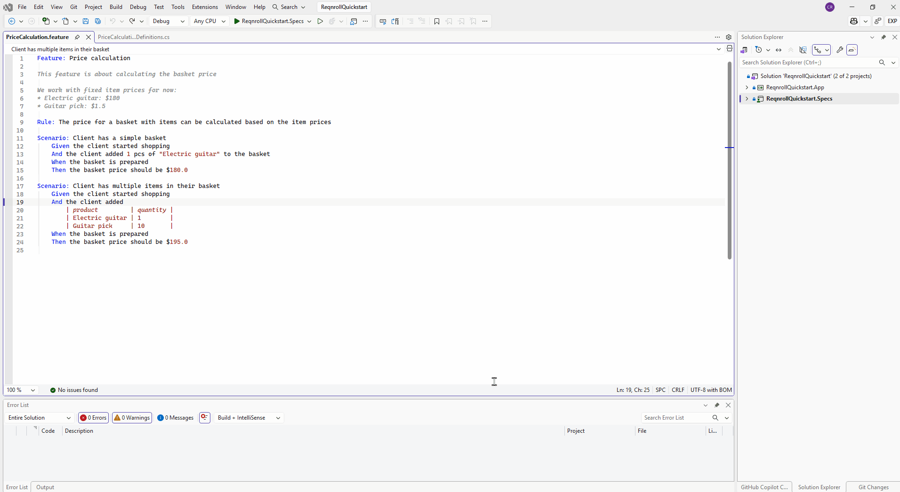
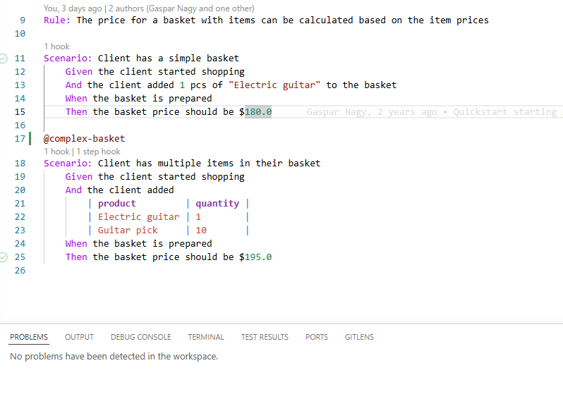

# Comment / Uncomment

The standard comment-toggle shortcut (`Ctrl+/` on Windows/Linux, `Cmd+/` on
macOS) toggles `#` comments on the selected line(s) in a `.feature` file —
it just works, the same as it would in any other file type. No custom menu
is required for the common case, but each IDE also exposes it as a
discoverable menu command:

:::{tab-set}

```{tab-item} Visual Studio
:sync: vs

`Ctrl+/` works directly. Also available via right-click →
**Comment/Uncomment** in the code editor context menu.


```

```{tab-item} VS Code
:sync: vscode

`Ctrl+/` (`Cmd+/` on macOS) works directly. Also available via right-click
→ **Reqnroll: Comment/Uncomment**, or the Command Palette.


```

```{tab-item} Rider
:sync: rider

`Ctrl+/` works directly. Also available via right-click →
**Comment/Uncomment**, or **Tools → Reqnroll → Comment/Uncomment**.

TODO(media): 🎬 gif (optional, low priority).
**Target:** `comment-uncomment/comment-uncomment-rider.gif`
```

:::
