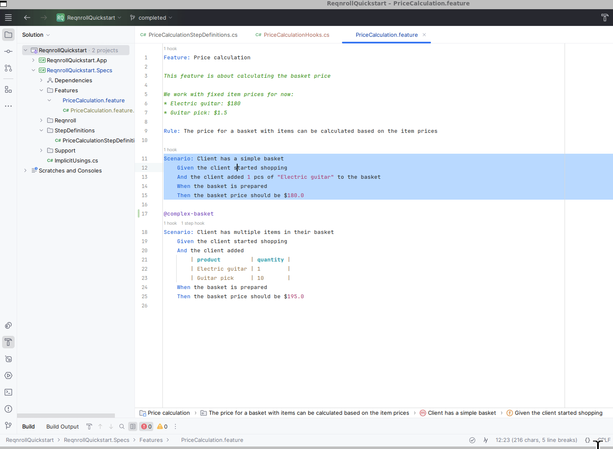

# Comment / Uncomment

The standard comment shortcuts toggle `#` comments on the selected line(s) in
a `.feature` file, the same as they would in any other file type (`Ctrl+/` on
Windows/Linux, `Cmd+/` on macOS). If nothing is selected, the line with the
cursor is used.

Visual Studio also supports its separate Comment Selection and Uncomment
Selection commands. VS Code and Rider have a menu command as well:

:::{tab-set}

```{tab-item} Visual Studio
:sync: vs

Reqnroll uses Visual Studio's standard comment commands, so they work with
their default shortcuts, from the **Edit → Advanced** menu, and with any
shortcut you've assigned to them yourself:

| Command | Default shortcut | What it does in a `.feature` file |
|---|---|---|
| **Edit.ToggleLineComment** | `Ctrl+/` | Uncomments the lines if they are all commented; otherwise comments them all |
| **Edit.CommentSelection** | `Ctrl+K, Ctrl+C` | Always adds a `#`, even to lines that are already commented |
| **Edit.UncommentSelection** | `Ctrl+K, Ctrl+U` | Removes one `#` from each commented line and leaves other lines unchanged |

There is no Reqnroll-specific Comment/Uncomment command in the context menu.
If you changed the shortcut, use **Tools → Options → Environment → Keyboard**
and set it on the `Edit.*` commands above.


```

```{tab-item} VS Code
:sync: vscode

`Ctrl+/` (`Cmd+/` on macOS) works directly. Also available via right-click
→ **Reqnroll: Comment/Uncomment**, or the Command Palette.


```

```{tab-item} Rider
:sync: rider

`Ctrl+/` works directly. Also available via right-click →
**Comment/Uncomment**, or **Tools → Reqnroll → Comment/Uncomment**.


```

:::
