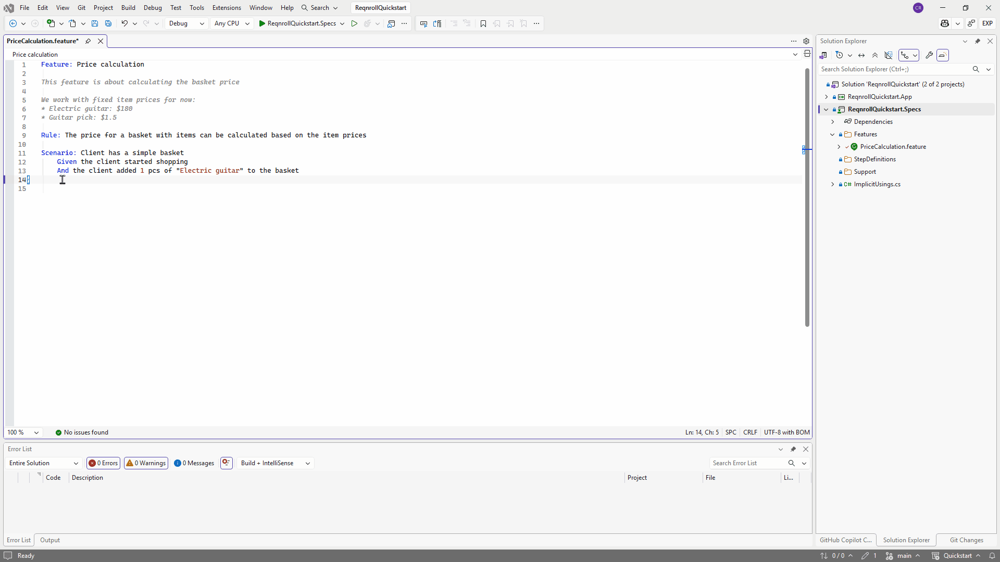
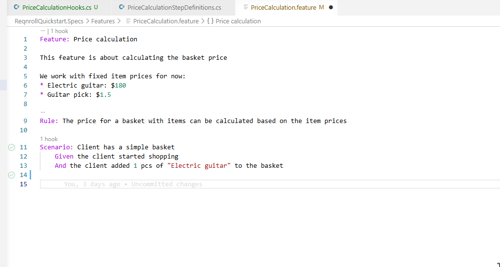

# Keyword & Step Completion

## Keyword completion

Typing at the start of a line in a scenario offers completions for the
keywords valid at that point (`Given`, `When`, `Then`, `And`, `But`,
`Scenario:`, `Feature:`, and so on). Completions are context-sensitive —
`Examples:` is only offered inside a Scenario Outline, `Background:` only
at feature level.

## Step completion

Typing a step line after a keyword offers completions for existing step
binding patterns, with parameter placeholders shown distinctly, and inserts
the full step text on selection.

:::{tab-set}

```{tab-item} Visual Studio
:sync: vs


```

```{tab-item} VS Code
:sync: vscode


```

```{tab-item} Rider
:sync: rider

TODO(media): 🎬 gif — typing a keyword or step, the completion popup
appearing, and selecting an item.
**Target:** `completion/completion-rider.gif`
```

:::

```{admonition} Rider completion — confirmed
:class: note

Completion works in Rider — it auto-negotiates via the IDE platform's
generic LSP completion support (the same mechanism diagnostics uses), no
Rider-specific plugin code needed. Confirmed live; see
[#414](https://github.com/reqnroll/Reqnroll.IdeSupport/issues/414).
```

## Non-English (dialect) keywords

Completions are sourced from the active Gherkin dialect in the project's
`reqnroll.json`. A project configured with `"language": "de"` offers
`Gegeben`, `Wenn`, `Dann` rather than `Given`, `When`, `Then`. See
[Feature Language](https://docs.reqnroll.net/latest/gherkin/feature-language.html)
in the main Reqnroll docs for the full list of supported languages.
