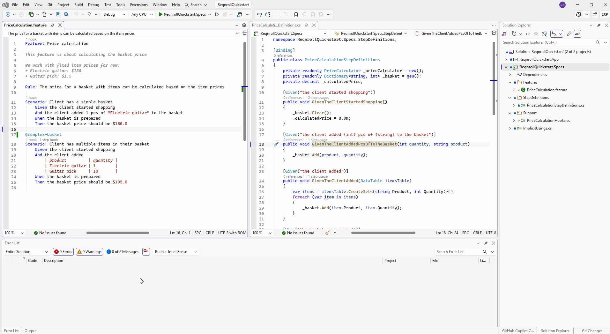

# Defining Steps

When a step in a `.feature` file has no matching binding, a quick-fix /
code action **"Define missing step"** (or **"Define all missing steps in
file"** when more than one step is undefined) appears — the lightbulb in
VS Code and Visual Studio, Alt+Enter in Rider. Activating it generates stub
binding methods with method signatures and parameter types inferred from
the step text.

## Where the generated method goes

If any existing step definition file in the project already has bindings
matched to steps in the same feature, that's offered as the default
target — the new method is **appended** to that file. When more than one
existing file already covers steps in the feature (or none do), each
option is offered as a separate action, with the target file named in the
action title (e.g. *"Define missing step → CalculatorSteps.cs"*), plus a
*"→ new file"* option that scaffolds a fresh `<FeatureName>StepDefinitions.cs`
alongside the best-matching existing file (or next to the feature file
itself, if nothing else in the project has any bindings for it yet).

```{admonition} Order of the offered options can vary by IDE
:class: note

VS Code and Rider list the append option before the new-file option, as
intended. Visual Studio's built-in quick-fix menu sorts same-priority
options alphabetically by their title text, so the two may appear in
either order there — both still work identically regardless of which one
is listed first.
```

:::{tab-set}

```{tab-item} Visual Studio
:sync: vs


```

```{tab-item} VS Code
:sync: vscode

TODO(media): 🎬 gif — invoking the quick-fix on an unmatched step in
VS Code and seeing the generated binding method.
**Target:** `defining-steps/defining-steps-vscode.gif`
```

```{tab-item} Rider
:sync: rider

TODO(media): 🎬 gif — invoking the quick-fix in Rider.
**Target:** `defining-steps/defining-steps-rider.gif`
```

:::

```{admonition} Rider — confirmed
:class: note

Works in Rider — it auto-negotiates via the platform's generic LSP
code-action support (the same way diagnostics/completion do), no
Rider-specific plugin code needed. Confirmed live; see
[#437](https://github.com/reqnroll/Reqnroll.IdeSupport/issues/437).
```

See also [New Project / Item Templates](../new-project-templates.md) for
scaffolding a brand-new `.feature` file or step definitions class (as
opposed to a single missing step).
