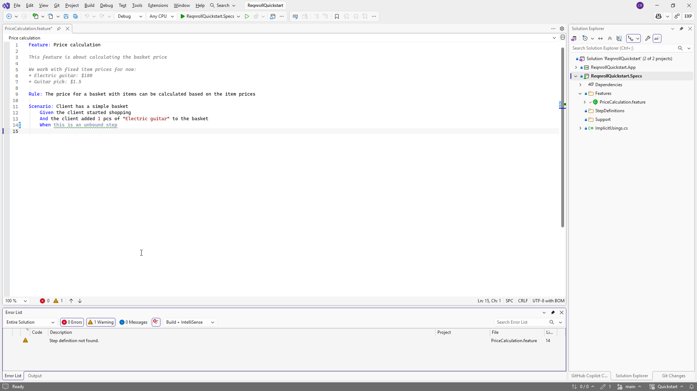
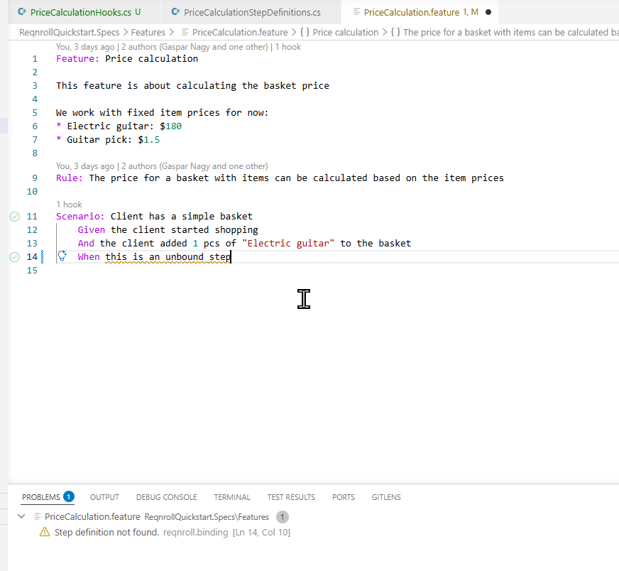
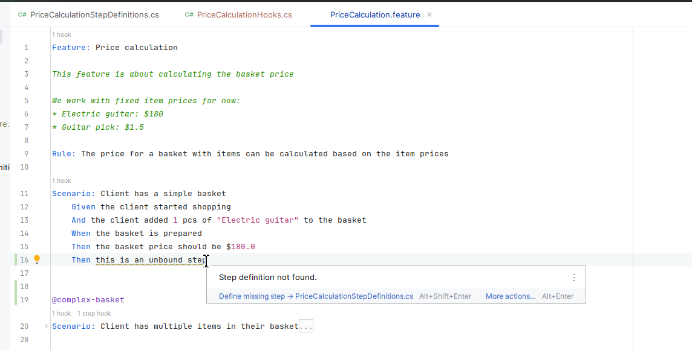

# Diagnostics — Errors & Warnings

Steps in a `.feature` file with no matching step definition are underlined
with a warning squiggle and listed in your IDE's Error List / Problems
panel. Structural errors — a missing `Feature:` header, invalid tag syntax,
and similar parse errors — are underlined with a red error squiggle instead,
so you can tell "not written correctly" apart from "no binding exists yet"
at a glance.

Diagnostics refresh live as you type, and whenever step bindings change (on
a C# file save or a build) — no need to reopen the file to see an unmatched
step turn green once you add the matching binding.

:::{tab-set}

```{tab-item} Visual Studio
:sync: vs



TODO(media): 🎬 gif (optional) — the squiggle disappearing live as a
matching binding is added. Nice to have; the screenshot above already
conveys the static state on its own.
**Target:** `diagnostics/diagnostics-vs-fix.gif`
```

```{tab-item} VS Code
:sync: vscode



TODO(media): 🎬 gif (optional) — the squiggle disappearing live as a
matching binding is added. Nice to have; the screenshot above already
conveys the static state on its own.
**Target:** `diagnostics/diagnostics-vscode-fix.gif`
```

```{tab-item} Rider
:sync: rider



TODO(media): 🎬 gif (optional) — the squiggle disappearing live as a
matching binding is added. Nice to have; the screenshot above already
conveys the static state on its own.
**Target:** `diagnostics/diagnostics-rider-fix.gif`
```

:::

## C# binding validation

A `[Given]`/`[When]`/`[Then]` or hook (`[BeforeScenario]`/`[AfterScenario]`/etc.) method that fails
one of Reqnroll's own structural rules gets a warning squiggle on the offending attribute in the
`.cs` file, with a hover message naming the specific problem — for example:

- The method is `async void` instead of returning `Task`.
- The method must be `static` (required for the four test-run/feature-scoped hooks —
  `[BeforeTestRun]`/`[AfterTestRun]`/`[BeforeFeature]`/`[AfterFeature]` — and for any binding
  method on an `abstract` binding class) but isn't.
- The binding class itself isn't a valid binding type — not a `class` (e.g. a `struct` or
  `record`), or a generic type definition.
- The step definition's expression text is malformed — an invalid Cucumber Expression (e.g. `({int})`,
  an optional containing a parameter) or an invalid plain regex.
- A **`[Scope(Tag = "...")]`** tag expression is malformed — on either a step definition or a hook.
  The full Cucumber tag-expression grammar is validated (`and`/`or`/`not`/parentheses), not just
  simple tag names, so a dangling operator (e.g. `"@a and"`) or unbalanced parentheses is caught the
  same way an invalid step expression is.

If a binding has more than one problem at once (e.g. a malformed scope expression on a type that
also isn't a valid binding class), every applicable message is shown together rather than only the
first one found.

This squiggle appears via your IDE's own C# editor surface, alongside whatever the native C#
language server already reports for the same file — the two sources merge with no conflict, so a
binding-validation warning shows up next to ordinary C# errors/warnings in the same Error List /
Problems panel.

```{admonition} A step's "no matching step definition" warning gets more specific too
:class: note

If a `.feature` step's text structurally matches an *invalid* binding — say, a step-definition
method that lost its required `static` modifier — the step's own warning in the `.feature` file
names that specific reason (e.g. "must be static") instead of the generic "no matching step
definition" message. This only applies when a near-miss invalid binding actually exists; an
ordinary unbound step still gets the generic message.
```

```{admonition} Not currently validated
:class: note

`[StepArgumentTransformation]` methods aren't discovered or validated by this check yet — only
step-definition and hook attributes are. General C# correctness (syntax errors, type errors, and
everything else the C# compiler itself owns) is unaffected and remains the native C# language
server's job, never this extension's.
```

:::{tab-set}

```{tab-item} Visual Studio
:sync: vs

TODO(media): 📷 screenshot — a `[Given]`/hook method with an invalid
`static`/`async void`/expression/scope problem, squiggled, with the hover
tooltip showing the specific message.
**Target:** `diagnostics/diagnostics-vs-csharp-squiggle.png`
```

```{tab-item} VS Code
:sync: vscode

TODO(media): 📷 screenshot — same capture as the Visual Studio tab, for
VS Code's Problems panel/hover.
**Target:** `diagnostics/diagnostics-vscode-csharp-squiggle.png`
```

```{tab-item} Rider
:sync: rider

TODO(media): 📷 screenshot — same capture as the Visual Studio tab, for
Rider's Problems pane/tooltip.
**Target:** `diagnostics/diagnostics-rider-csharp-squiggle.png`
```

:::
