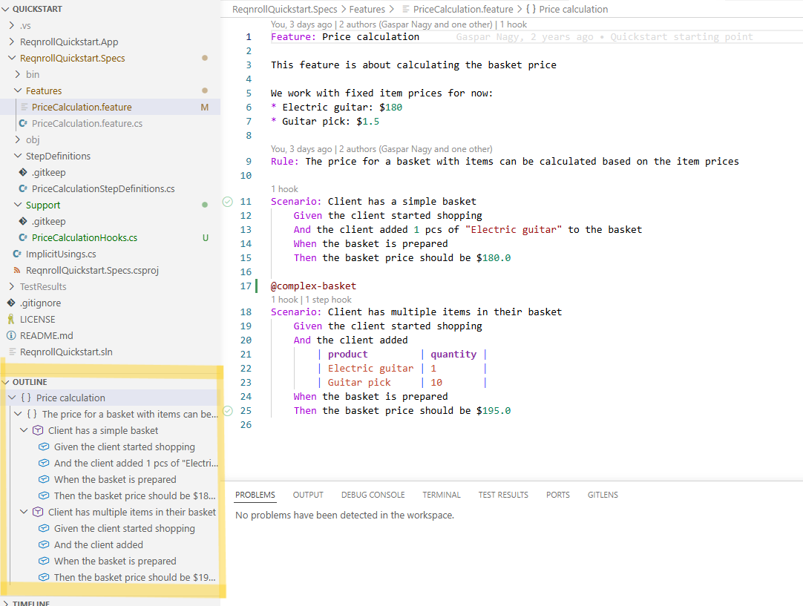

# Document Outline

Your IDE's Outline / Structure panel shows the hierarchy of the open
feature file — Feature → Background / Rule → Scenario / Scenario Outline →
Step — and clicking a node jumps to that location. Useful for navigating a
large feature file without scrolling.

* **VS Code**: shown in the native Outline panel.
* **Rider**: shown in a dedicated **Reqnroll Structure View** tool window
  (default shortcut `Alt+7`).

:::{tab-set}

```{tab-item} VS Code
:sync: vscode


```

```{tab-item} Rider
:sync: rider

TODO(media): 📷 screenshot — Rider's dedicated Structure View tool window
showing the same tree. Capture separately from VS Code's — they look
visually different.
**Target:** `document-outline/document-outline-rider.png`
```

:::

```{admonition} Visual Studio does not show a Gherkin outline
:class: warning

Visual Studio's native Document Outline window does not support `.feature`
files — this is a known VS limitation (its outline is built on an older
COM-based mechanism this extension's language server support doesn't route
through), not a bug in this extension. Outline navigation is available in
VS Code and Rider, as described above.
```

```{admonition} Why Rider gets a dedicated tool window, not its native Structure View
:class: note

Rider's own platform Structure View extension point isn't wired up for this
either, so this feature ships as its own **Reqnroll Structure View** tool
window instead of appearing in Rider's generic Structure View panel. This
is a deliberate design choice, not a bug — it's why the window looks
different from VS Code's native Outline.
```
