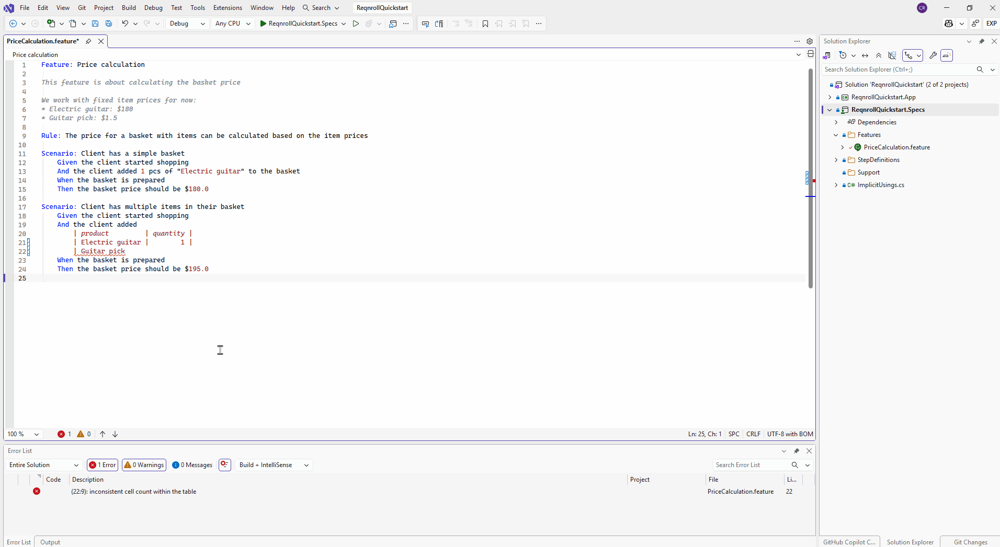

# Document & Table Formatting

## Format Document

Formatting the whole document (Shift+Alt+F, or your IDE's equivalent
shortcut) re-indents the entire `.feature` file: consistent indentation per
nesting level, normalized spacing around keywords, and blank lines between
scenarios. Formatting rules are read from `.editorconfig` — see
[Gherkin Formatting with EditorConfig](../editorconfig.md) for the full
settings reference.

## Table formatting

Typing `|` or pressing Enter inside a Gherkin data table or `Examples:`
table pads the columns so the pipes stay aligned as you type. A table can
also be re-aligned by running Format Document. A row missing its trailing
`|` gets one appended automatically.

:::{tab-set}

```{tab-item} Visual Studio
:sync: vs


```

```{tab-item} VS Code
:sync: vscode

TODO(media): 🎬 gif — before/after auto-format on save or on-type, and the
table column-alignment behavior as you type.
**Target:** `formatting/vscode.gif`
```

```{tab-item} Rider
:sync: rider

TODO(media): 🎬 gif — before/after Format Document, and the on-type `|`
table-column realignment behavior as you type. See the note below on
what's confirmed to work in Rider — capture once
[#415](https://github.com/reqnroll/Reqnroll.IdeSupport/issues/415) settles
the Enter/Tab-trigger question.
**Target:** `formatting/rider.gif`
```

:::

```{admonition} Visual Studio 2022 — built-in Gherkin formatter conflict
:class: warning

VS 2022 ships its own built-in Gherkin formatting service, which can
override this extension's on-type table formatting. If table alignment
doesn't seem to be happening as you type, check whether the built-in
service is intercepting the on-type formatting request.
```

```{admonition} Rider table formatting
:class: note

Both whole-document Format and on-type `|` table-column realignment are
implemented in Rider — Format Document works through the platform's
built-in formatting service, and on-type table realignment through
dedicated plugin code, matching the behavior described above. Live
cross-IDE confirmation (including whether Rider's Enter/Tab-triggered
realignment works, not just `|`) is tracked in
[#415](https://github.com/reqnroll/Reqnroll.IdeSupport/issues/415).
```
