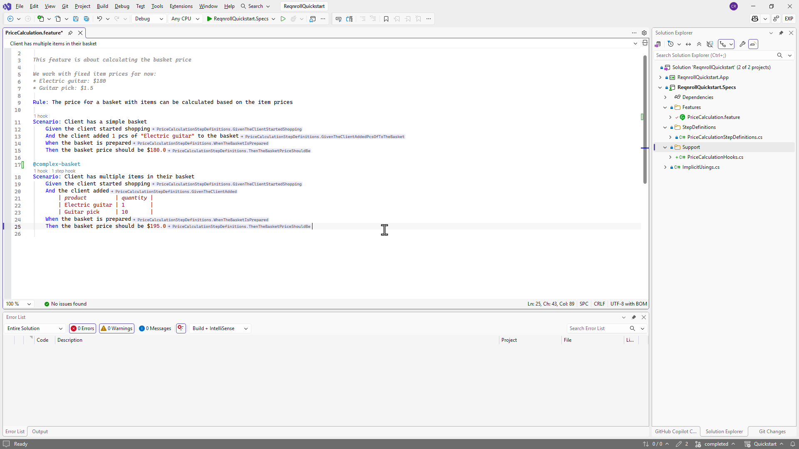
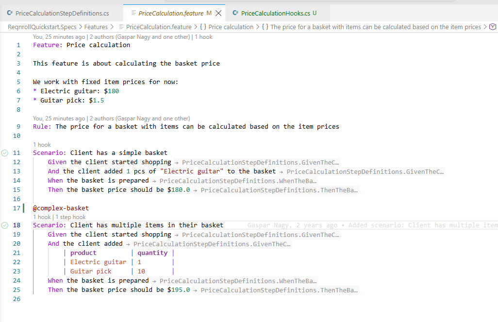

# Inlay Hints — Bound Step Info

Each step in a `.feature` file shows an inline hint after the step text
indicating what it's bound to:

* `→ ClassName.MethodName` for a step with exactly one matching binding.
* `→ N matches` for an ambiguous step (matched by more than one binding).
* `→ N bindings` for a step whose match comes from a templated / Scenario
  Outline binding.
* An undefined step (no matching binding) shows no hint — that case is
  already covered by the [warning diagnostic](diagnostics.md).

Hovering a hint shows the full signature (declaring type and parameter
types) in a tooltip. Hints refresh automatically as you edit.

:::{tab-set}

```{tab-item} Visual Studio
:sync: vs

Visual Studio does not show the hover tooltip — this is a Visual Studio limitation. The `→ ClassName.MethodName` / `→ N matches`
/ `→ N bindings` labels themselves display normally.


```

```{tab-item} VS Code
:sync: vscode


```

```{tab-item} Rider
:sync: rider

TODO(media): 📷 screenshot — the same, in Rider.
**Target:** `inlay-hints/inlay-hints-rider.png`
```

:::

## Enabling / disabling hints

There is no Reqnroll-specific setting or hotkey for this — the language
server always provides hints when the IDE asks for them, and
showing/hiding is entirely each IDE's own native inlay-hints mechanism:

| IDE | How to toggle |
|---|---|
| **Visual Studio** | Tools → Options → Text Editor → Advanced, or the equivalent inline-hints display toggle (Alt-F1) — the same generic setting used for any inlay hint, not Reqnroll-specific. |
| **VS Code** | Native `editor.inlayHints.enabled` setting (`on` / `off` / `offUnlessPressed` / `onUnlessPressed`). In an `...UnlessPressed` mode, holding the default modifier key (Ctrl-Alt on Windows/Linux, ⌥ on Mac) temporarily shows/hides hints. |
| **Rider** | Editor → General → Inlay Hints — same generic Rider setting used for any inlay hint. |
