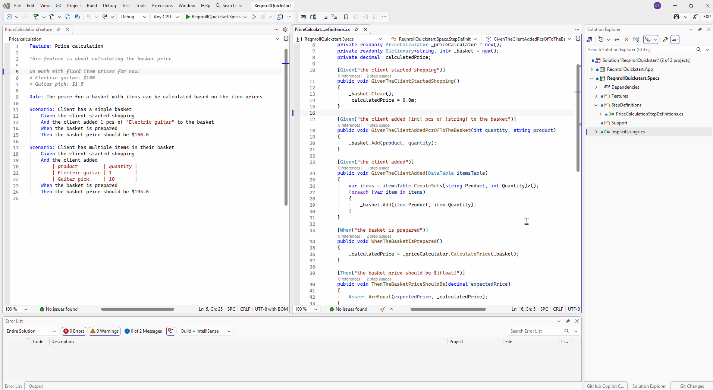
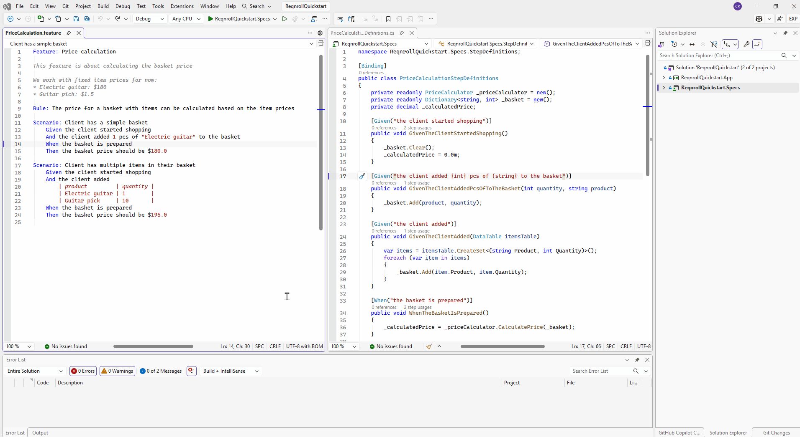
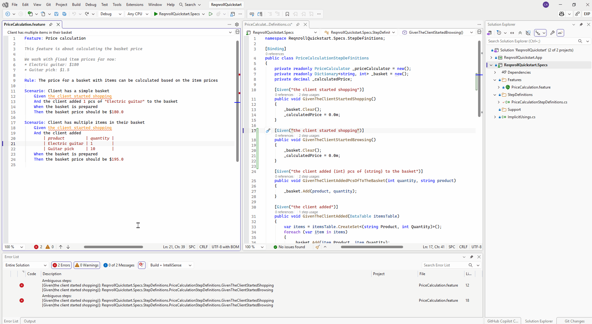

# Rename Step

Renaming a step's text — from either the `.feature` file step line or the
C# `[Given("...")]`/`[When("...")]`/`[Then("...")]` attribute string —
updates every occurrence across the workspace: the attribute string in the
binding class, and every matching step in every `.feature` file.

::::{tab-set}

```{tab-item} Visual Studio
:sync: vs

Place the cursor on the step (in a `.feature` file) or the attribute string
(in a `.cs` file) and invoke the standard **Rename** gesture (F2). This
handles the common, unambiguous case directly.

**Renaming from the feature file**



**Renaming from the binding expression**



**Renaming an ambiguously bound step**

If a binding method has more than one candidate attribute, use
**Extensions → Reqnroll → Rename Step** instead — it opens a dialog with a
picker to choose which binding to rename.


```

```{tab-item} VS Code
:sync: vscode

Place the cursor on the step (in a `.feature` file) and press **F2**, or
on the attribute string (in a `.cs` file) and use the standard **Rename
Symbol** gesture. On the `.feature` side, F2 is also available via
right-click → **Reqnroll: Rename Step** or the Command Palette.

**Renaming from the feature file**

TODO(media): 🎬 gif — cursor on a step in a `.feature` file, invoking
rename (F2), typing a new step text, and watching the C# attribute string
update to match.
**Target:** `rename-step/rename-step-vscode-feature.gif`

**Renaming from the binding expression**

TODO(media): 🎬 gif — cursor in the attribute string in a `.cs` file,
invoking rename (F2), typing a new expression, and watching every matching
`.feature` step update.
**Target:** `rename-step/rename-step-vscode-cs.gif`

VS Code doesn't yet support a disambiguation picker for ambiguously bound
steps, so there's no third capture for this tab — see the note below.

:::{admonition} Known limitation with ambiguous bindings
:class: warning

If a step is bound to more than one candidate attribute (multi-attribute
disambiguation), VS Code's rename does not yet support choosing which one
you mean. **Workaround:** place your cursor directly in the specific
attribute string you want to rename, rather than on the step in the
`.feature` file, before invoking rename.

This limitation is specific to VS Code. Rider and Visual Studio both
implement rename **with** disambiguation — a picker lets you choose which
candidate binding to rename when a step matches more than one (see the
Visual Studio and Rider tabs for how to reach that picker).
:::
```

```{tab-item} Rider
:sync: rider

- **On the `.feature` step line:** press **Shift+F6**, or right-click →
  **Rename Step**.
- **On the C# attribute:** right-click → **Rename Step (Reqnroll)** — a
  distinct context-menu entry from Rider's native "Rename", since native
  Shift+F6 stays bound to ordinary C# symbol rename here.

Both surfaces handle disambiguation via a picker when the binding has more
than one candidate attribute.

**Renaming from the feature file**

TODO(media): 🎬 gif — cursor on a step in a `.feature` file, invoking
rename (Shift+F6), typing a new step text, and watching the C# attribute
string update to match.
**Target:** `rename-step/rename-step-rider-feature.gif`

**Renaming from the binding expression**

TODO(media): 🎬 gif — cursor in the attribute string in a `.cs` file,
invoking **Rename Step (Reqnroll)**, typing a new expression, and watching
every matching `.feature` step update.
**Target:** `rename-step/rename-step-rider-cs.gif`

**Renaming an ambiguously bound step**

TODO(media): 🎬 gif — invoking rename on a step/method with more than one
candidate binding attribute, showing Rider's disambiguation picker and
selecting a candidate to rename — not just a port of the VS capture, since
Rider's picker UI differs visually.
**Target:** `rename-step/rename-step-rider-picker.gif`
```

::::
