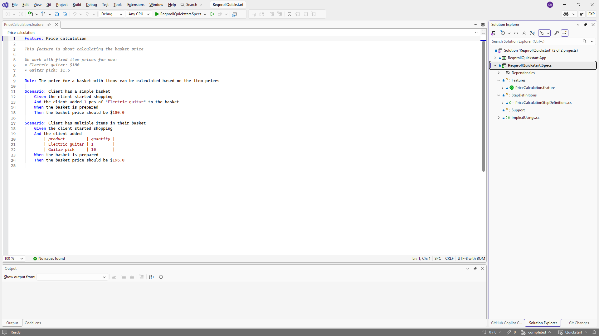

# Reqnroll IDE Support (Preview)

The Reqnroll team now provides **Reqnroll IDE Support** for all three major
IDEs used by Reqnroll developers — **Visual Studio**, **Visual Studio
Code**, and **JetBrains Rider** — with the same advanced feature set across
all of them: syntax highlighting, diagnostics, completion, navigation
between steps and bindings, refactoring, and more. Whichever IDE you use,
you get the same capabilities and the same editing experience.

:::::{div} reqnroll-hero-carousel
:name: reqnroll-hero-carousel

::::{div} reqnroll-hero-slide is-active
:name: reqnroll-hero-slide-vs

:::{div} reqnroll-hero-media

:::

Visual Studio
::::

::::{div} reqnroll-hero-slide
:name: reqnroll-hero-slide-vscode

:::{div} reqnroll-hero-media

TODO(media): 📷 hero screenshot — the same, in VS Code.
**Target:** `index/vscode.png`
:::

VS Code
::::

::::{div} reqnroll-hero-slide
:name: reqnroll-hero-slide-rider

:::{div} reqnroll-hero-media

TODO(media): 📷 hero screenshot — the same, in Rider.
**Target:** `index/rider.png`
:::

Rider
::::

:::::

```{raw} html
<style>
.reqnroll-hero-carousel {
  position: relative;
  margin: 1.5rem 0 2rem;
  border-radius: 0.5rem;
  overflow: hidden;
  background: var(--color-background-secondary);
  border: 1px solid var(--color-background-border);
  aspect-ratio: 16 / 9;
  max-height: 480px;
}
.reqnroll-hero-slide {
  position: absolute;
  inset: 0;
  display: flex;
  flex-direction: column;
  align-items: center;
  justify-content: center;
  gap: 0.75rem;
  opacity: 0;
  pointer-events: none;
  transition: opacity 0.6s ease;
  padding: 1rem;
  text-align: center;
}
.reqnroll-hero-slide.is-active {
  opacity: 1;
  pointer-events: auto;
}
/* Wrapper has no intrinsic aspect ratio of its own, so it correctly
   participates in flex-grow/shrink; the img is then absolutely
   positioned to fill it and object-fit does the rest. Without this
   wrapper, a flex item that's a replaced element with an intrinsic
   aspect ratio (an ) can ignore flex-basis/min-height:0 sizing
   entirely and just render at its own aspect-ratio-derived size,
   overflowing the fixed-height carousel and getting clipped. */
.reqnroll-hero-media {
  position: relative;
  flex: 1 1 0%;
  min-height: 0;
  width: 100%;
}
.reqnroll-hero-media img {
  position: absolute;
  inset: 0;
  width: 100%;
  height: 100%;
  object-fit: contain;
  border-radius: 0.25rem;
  box-shadow: 0 2px 12px rgba(0, 0, 0, 0.25);
}
.reqnroll-hero-slide p:last-child {
  flex: 0 0 auto;
  margin: 0;
  font-weight: 600;
  color: var(--color-foreground-secondary);
}
.reqnroll-hero-nav {
  position: absolute;
  top: 50%;
  transform: translateY(-50%);
  z-index: 2;
  background: var(--color-background-primary);
  border: 1px solid var(--color-background-border);
  color: var(--color-foreground-primary);
  width: 2.25rem;
  height: 2.25rem;
  border-radius: 50%;
  cursor: pointer;
  font-size: 1.25rem;
  line-height: 1;
  display: flex;
  align-items: center;
  justify-content: center;
  opacity: 0.85;
}
.reqnroll-hero-nav:hover,
.reqnroll-hero-nav:focus-visible {
  opacity: 1;
}
.reqnroll-hero-nav.reqnroll-hero-prev { left: 0.75rem; }
.reqnroll-hero-nav.reqnroll-hero-next { right: 0.75rem; }
.reqnroll-hero-dots {
  position: absolute;
  bottom: 0.75rem;
  left: 50%;
  transform: translateX(-50%);
  z-index: 2;
  display: flex;
  gap: 0.5rem;
}
.reqnroll-hero-dot {
  width: 0.6rem;
  height: 0.6rem;
  border-radius: 50%;
  border: 1px solid var(--color-background-border);
  background: var(--color-background-primary);
  opacity: 0.6;
  cursor: pointer;
  padding: 0;
}
.reqnroll-hero-dot.is-active {
  opacity: 1;
  background: var(--color-brand-primary, var(--color-foreground-primary));
}
</style>
<script>
(function () {
  function setUpCarousel(carousel) {
    var slides = Array.prototype.slice.call(
      carousel.querySelectorAll(':scope > .reqnroll-hero-slide')
    );
    if (slides.length < 2) return;

    var interval = parseInt(carousel.getAttribute('data-interval'), 10) || 5000;
    var reducedMotion = window.matchMedia('(prefers-reduced-motion: reduce)').matches;
    var current = slides.findIndex(function (s) { return s.classList.contains('is-active'); });
    if (current < 0) current = 0;
    var timer = null;

    function show(index) {
      slides[current].classList.remove('is-active');
      dots[current].classList.remove('is-active');
      dots[current].setAttribute('aria-selected', 'false');
      current = (index + slides.length) % slides.length;
      slides[current].classList.add('is-active');
      dots[current].setAttribute('aria-selected', 'true');
      dots[current].classList.add('is-active');
    }

    function next() { show(current + 1); }
    function prev() { show(current - 1); }

    function play() {
      if (reducedMotion) return;
      stop();
      timer = window.setInterval(next, interval);
    }
    function stop() {
      if (timer) { window.clearInterval(timer); timer = null; }
    }

    var prevBtn = document.createElement('button');
    prevBtn.type = 'button';
    prevBtn.className = 'reqnroll-hero-nav reqnroll-hero-prev';
    prevBtn.setAttribute('aria-label', 'Previous screenshot');
    prevBtn.textContent = '‹';
    prevBtn.addEventListener('click', function () { prev(); play(); });

    var nextBtn = document.createElement('button');
    nextBtn.type = 'button';
    nextBtn.className = 'reqnroll-hero-nav reqnroll-hero-next';
    nextBtn.setAttribute('aria-label', 'Next screenshot');
    nextBtn.textContent = '›';
    nextBtn.addEventListener('click', function () { next(); play(); });

    var dotsContainer = document.createElement('div');
    dotsContainer.className = 'reqnroll-hero-dots';
    dotsContainer.setAttribute('role', 'tablist');
    dotsContainer.setAttribute('aria-label', 'Choose screenshot');

    var dots = slides.map(function (slide, i) {
      var dot = document.createElement('button');
      dot.type = 'button';
      dot.className = 'reqnroll-hero-dot' + (i === current ? ' is-active' : '');
      dot.setAttribute('role', 'tab');
      dot.setAttribute('aria-selected', i === current ? 'true' : 'false');
      var label = slide.querySelector('p:last-child');
      dot.setAttribute('aria-label', (label ? label.textContent : 'Slide ' + (i + 1)) + ' screenshot');
      dot.addEventListener('click', function () { show(i); play(); });
      dotsContainer.appendChild(dot);
      return dot;
    });

    carousel.appendChild(prevBtn);
    carousel.appendChild(nextBtn);
    carousel.appendChild(dotsContainer);

    carousel.addEventListener('mouseenter', stop);
    carousel.addEventListener('mouseleave', play);
    carousel.addEventListener('focusin', stop);
    carousel.addEventListener('focusout', play);

    play();
  }

  document.addEventListener('DOMContentLoaded', function () {
    document
      .querySelectorAll('.reqnroll-hero-carousel')
      .forEach(setUpCarousel);
  });
})();
</script>
```

```{admonition} Preview status
:class: important

This extension is currently in **Preview**. It can be installed alongside
the existing [Reqnroll for Visual Studio](https://docs.reqnroll.net/latest/ide-integrations/visual-studio/index.html)
extension — installing one does not remove the other, and there is no
automatic migration between them — but running both **enabled** at once is
not a supported configuration; see
[Troubleshooting / FAQ](troubleshooting.md#can-i-have-both-extensions-installed-at-once).
It is intended to eventually replace the legacy Visual Studio extension
once feature parity and stability criteria are met; those criteria will be
published here once finalized.
```

* [Installation](installation/index.md) — install the extension for your IDE
* [Upgrading](upgrading.md) — what happens on first install vs. an upgrade
* [Feature Overview](feature-overview.md) — every feature, with a per-IDE support matrix
* [Editing Features](editing-features/index.md) — syntax highlighting, diagnostics, completion, formatting
* [Navigation Features](navigation-features/index.md) — jump between steps, bindings, and hooks
* [New Project / Item Templates](new-project-templates.md) — Visual Studio project/item wizards
* [Extension Settings](settings.md) — configure the extension per IDE
* [Gherkin Formatting with EditorConfig](editorconfig.md) — consistent formatting via `.editorconfig`
* [Keyboard Shortcuts](keyboard-shortcuts.md) — every Reqnroll command's shortcut/menu location, one table per IDE
* [Troubleshooting / FAQ](troubleshooting.md) — known per-IDE limitations, coexistence, reporting bugs

```{admonition} New to Reqnroll itself?
:class: tip

This site covers the IDE extensions only. If you're new to Reqnroll as a
BDD framework, start with the main
[Reqnroll Quickstart guide](https://docs.reqnroll.net/latest/quickstart/index.html)
instead — it walks through writing your first feature file and step
definitions from scratch. Come back here once you're looking for IDE-
specific editing/navigation help.
```

```{toctree}
:hidden:

installation/index
upgrading
feature-overview
editing-features/index
navigation-features/index
new-project-templates
settings
editorconfig
keyboard-shortcuts
troubleshooting
```
