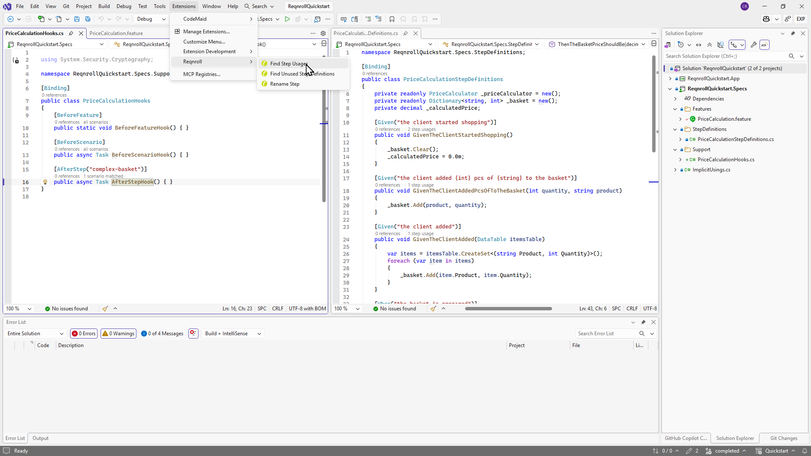

# Keyboard Shortcuts

A single reference for every Reqnroll command's shortcut or menu location,
one table per IDE. Commands with no default shortcut are reached through a
menu instead — see the linked feature page for the full how-to.

:::{tab-set}

````{tab-item} Visual Studio
:sync: vs

| Command | Shortcut | Menu |
|---|---|---|
| [Go to Step Definition](navigation-features/go-to-definition.md) | F12, or Ctrl+Click | — |
| [Rename Step](editing-features/rename-step.md) | F2 (unambiguous binding) | Extensions → Reqnroll → Reqnroll: Rename Step (ambiguous binding, opens picker dialog) |
| [Comment / Uncomment](editing-features/comment-uncomment.md) | Ctrl+/ | Right-click → Comment/Uncomment |
| [Format Document](editing-features/formatting.md) | Ctrl+K, Ctrl+D *(native VS default)* | — |
| [Find Step Definition Usages](navigation-features/find-usages.md) | — | Right-click → Find Step Usages, or Extensions → Reqnroll → Find Step Usages |
| [Find Unused Step Definitions](navigation-features/find-unused.md) | — | Extensions → Reqnroll → Find Unused Step Definitions |
| [Hook Navigation](navigation-features/hook-navigation.md) | — | Right-click → Go to Hooks |
| [Define Missing Steps](editing-features/defining-steps.md) (quick-fix) | Ctrl+. (lightbulb) *(native VS default)* | — |



````

````{tab-item} VS Code
:sync: vscode

| Command | Shortcut | Menu |
|---|---|---|
| [Go to Step Definition](navigation-features/go-to-definition.md) | F12, or Ctrl+Click / Cmd+Click | — |
| [Rename Step](editing-features/rename-step.md) | F2 | Right-click → Reqnroll: Rename Step |
| [Comment / Uncomment](editing-features/comment-uncomment.md) | Ctrl+/ (Cmd+/ on macOS) | Right-click → Reqnroll: Comment/Uncomment |
| [Format Document](editing-features/formatting.md) | Shift+Alt+F (⇧⌥F on macOS) *(native VS Code default)* | — |
| [Find Step Definition Usages](navigation-features/find-usages.md) | — | Right-click → Reqnroll: Find Step Usages, or Command Palette |
| [Find Unused Step Definitions](navigation-features/find-unused.md) | — | Command Palette → Reqnroll: Find Unused Step Definitions |
| [Hook Navigation](navigation-features/hook-navigation.md) | — | Right-click → Reqnroll: Go to Hooks, or Command Palette |
| [Define Missing Steps](editing-features/defining-steps.md) (quick-fix) | Ctrl+. (Cmd+. on macOS) *(native VS Code default)* | — |
| [Toggle inlay hints](editing-features/inlay-hints.md) | Hold Ctrl-Alt (⌥ on macOS) *(only in an `...UnlessPressed` mode)* | — |
````

````{tab-item} Rider
:sync: rider

| Command | Shortcut | Menu |
|---|---|---|
| [Go to Step Definition](navigation-features/go-to-definition.md) | Ctrl+B / Cmd+B, or Ctrl+Click *(native Rider "Go to Declaration" default)* | — |
| [Rename Step](editing-features/rename-step.md) — `.feature` side | Shift+F6 | Right-click → Reqnroll: Rename Step |
| [Rename Step](editing-features/rename-step.md) — C# side | — *(native Rider Shift+F6 stays bound to ordinary C# rename)* | Right-click → Reqnroll: Rename Step |
| [Comment / Uncomment](editing-features/comment-uncomment.md) | Ctrl+/ | Right-click → Comment/Uncomment, or Tools → Reqnroll → Comment/Uncomment |
| [Format Document](editing-features/formatting.md) | Ctrl+Alt+L (⌘⌥L on macOS) *(native Rider "Reformat Code" default)* | — |
| [Find Step Definition Usages](navigation-features/find-usages.md) | — | Right-click → Find Step Usages, or Tools → Reqnroll → Find Step Usages |
| [Find Unused Step Definitions](navigation-features/find-unused.md) | — | Tools → Reqnroll → Find Unused Step Definitions |
| [Hook Navigation](navigation-features/hook-navigation.md) | — | Right-click → Go to Hooks, or Tools → Reqnroll → Go to Hooks |

TODO(media): 📷 screenshot of the Tools → Reqnroll submenu.
**Target:** `keyboard-shortcuts/keyboard-shortcuts-rider-menu.png`
````

:::

```{admonition} Native IDE shortcuts vs. Reqnroll-specific commands
:class: note

Rows marked *(native ... default)* are your IDE's own keybinding for a
generic editor action (rename, format, go-to-declaration, quick-fix) that
Reqnroll participates in — they're not something this extension defines,
and they'll differ if you've customized your keymap. Rows with no such
note are commands this extension adds.
```
