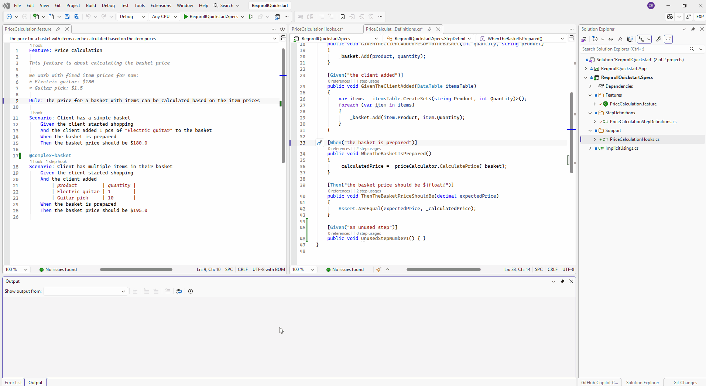
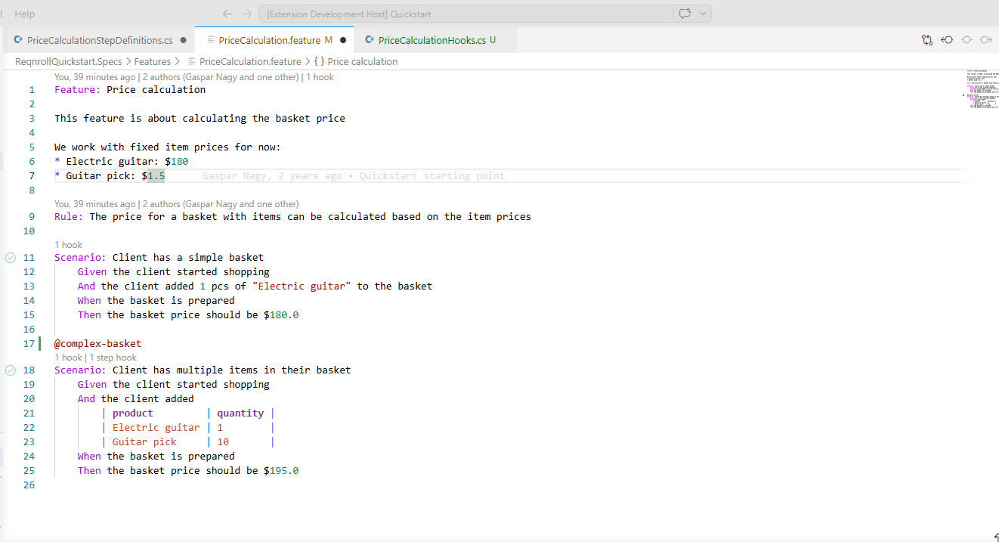
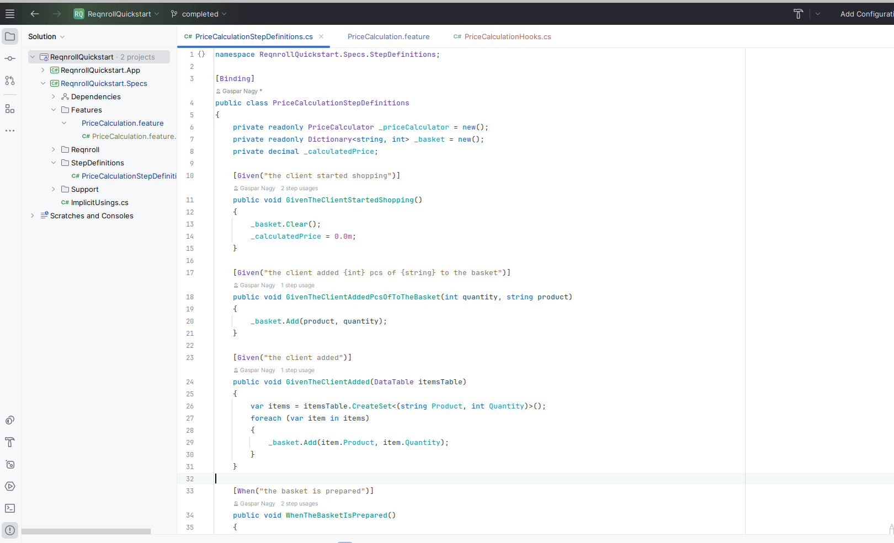

# Find Unused Step Definitions

The **Find Unused Step Definitions** command scans your project's step
bindings against every `.feature` file in the workspace and reports any
binding method with zero matching steps — useful for spotting dead code
after a scenario is rewritten or removed. It's a workspace-wide operation
— unlike [Find Step Definition Usages](find-usages.md), it doesn't need
your cursor on anything first.

:::{tab-set}

```{tab-item} Visual Studio
:sync: vs

**Extensions → Reqnroll → Find Unused Step Definitions**. There's no
editor context-menu placement or keybinding for this one — it's a
workspace-wide scan, not tied to a specific line.


```

```{tab-item} VS Code
:sync: vscode

Command Palette → **Reqnroll: Find Unused Step Definitions**. No
context-menu placement or default keybinding.


```

```{tab-item} Rider
:sync: rider

**Tools → Reqnroll → Find Unused Step Definitions**. No editor
context-menu placement or keybinding.


```

:::
