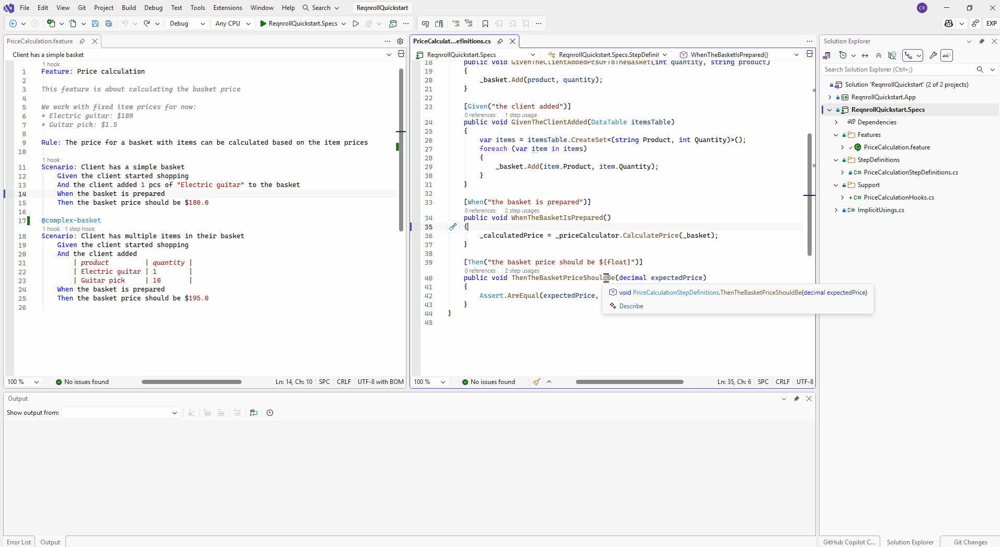
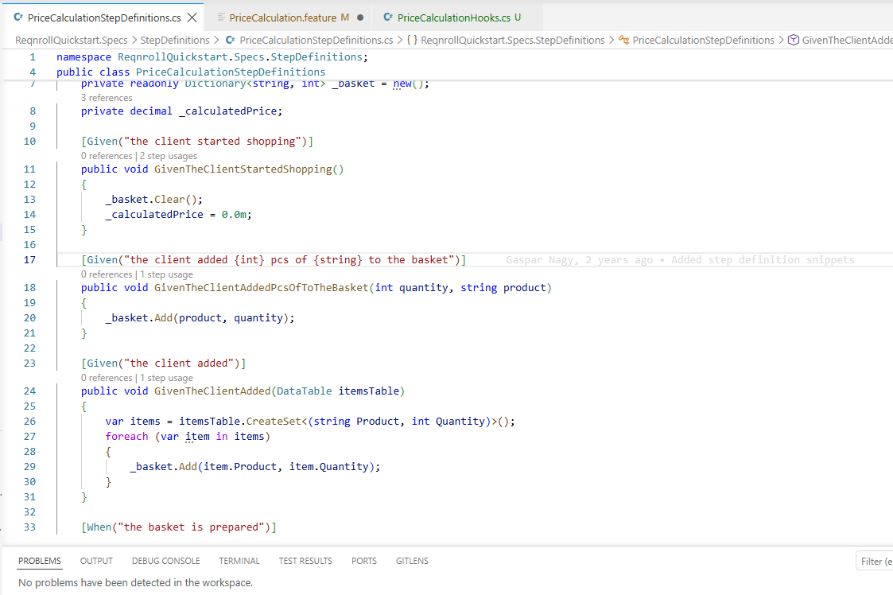
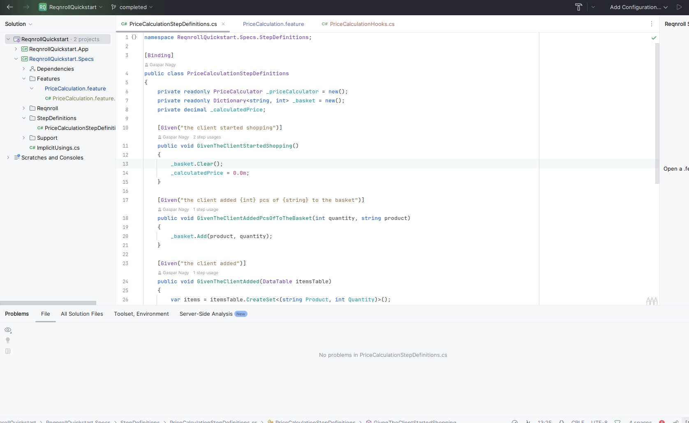

# Find Step Definition Usages

Invoking **Find Step Usages** on a C# step binding method (a method
decorated with `[Given]`, `[When]`, or `[Then]`) finds every `.feature`
step that matches that binding and lists them in your IDE's references
panel. This is the inverse of [Go to Step Definition](go-to-definition.md).

:::{tab-set}

`````{tab-item} Visual Studio
:sync: vs

Place the cursor on a binding attribute or on the binding method declaration in a `.cs` file,
then either:

- Right-click → **Find Step Usages** (in the code editor context menu,
  next to "Find All References"), or
- **Extensions → Reqnroll → Find Step Usages**.

Results open in the standard Find All References window.



```{admonition} Visual Studio — native "Find All References" doesn't reach this
:class: warning

Visual Studio's built-in **Find All References** (Shift+F12) does not route
to Reqnroll bindings — it only searches C# symbol references. Use
**Find Step Usages** instead (see above), not the native command.
```
`````

```{tab-item} VS Code
:sync: vscode

Place the cursor on a binding attribute or on the binding method declaration in a `.cs` file,
then either:

- Right-click → **Reqnroll: Find Step Usages**, or
- Command Palette → **Reqnroll: Find Step Usages**.

Results appear in a Quick Pick list — selecting an entry jumps to that
step in its `.feature` file.


```

```{tab-item} Rider
:sync: rider

Place the cursor on a binding attribute or on the binding method declaration in a `.cs` file,
then either:

- Right-click → **Find Step Usages**, or
- **Tools → Reqnroll → Find Step Usages**.


```

:::

```{tip}
You don't always need to invoke this explicitly — [Code Lens](../editing-features/code-lens.md)
shows the same usage count inline above every step binding method while
you're reading the code, and clicking it opens these same results.
```

## Caret position

**Find Step Usages** only recognizes the caret when it's on the binding's
attribute line or the method signature line — not anywhere in the method
body. This applies uniformly across Visual Studio, VS Code, and Rider, and
regardless of whether the binding is discovered from a Reqnroll project in
the solution or from a referenced external assembly.

If the caret is inside the method body (or anywhere else not on a step
binding), the command does **not** fall back to the IDE's native Find All
References — it reports that the caret isn't on a binding:

- Visual Studio and Rider show a status/info message.
- VS Code shows an information popup.

There is no interception of the native Find All References command (a
"Shift+F12 takeover" was considered during design but was never
implemented), so invoking that native command from inside a method body
searches C# symbol references only, the same as it would for any other
C# method.
