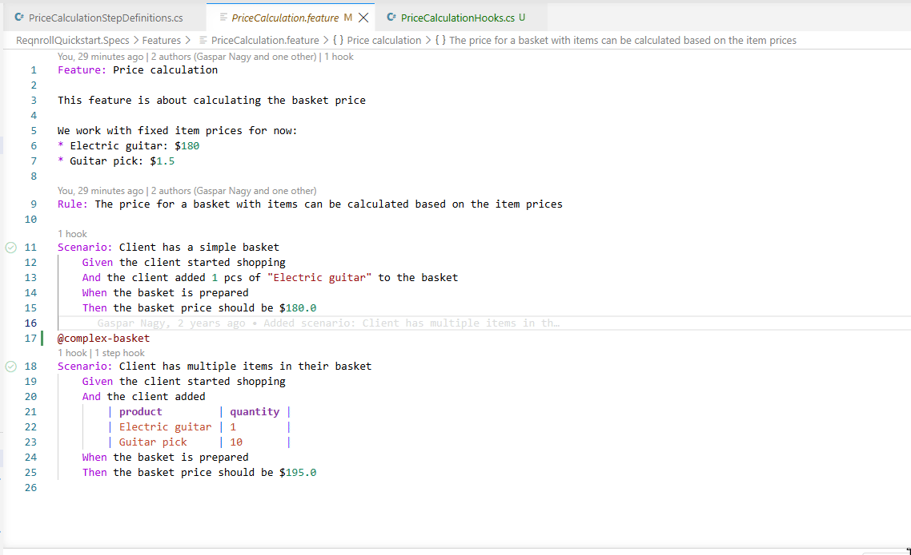
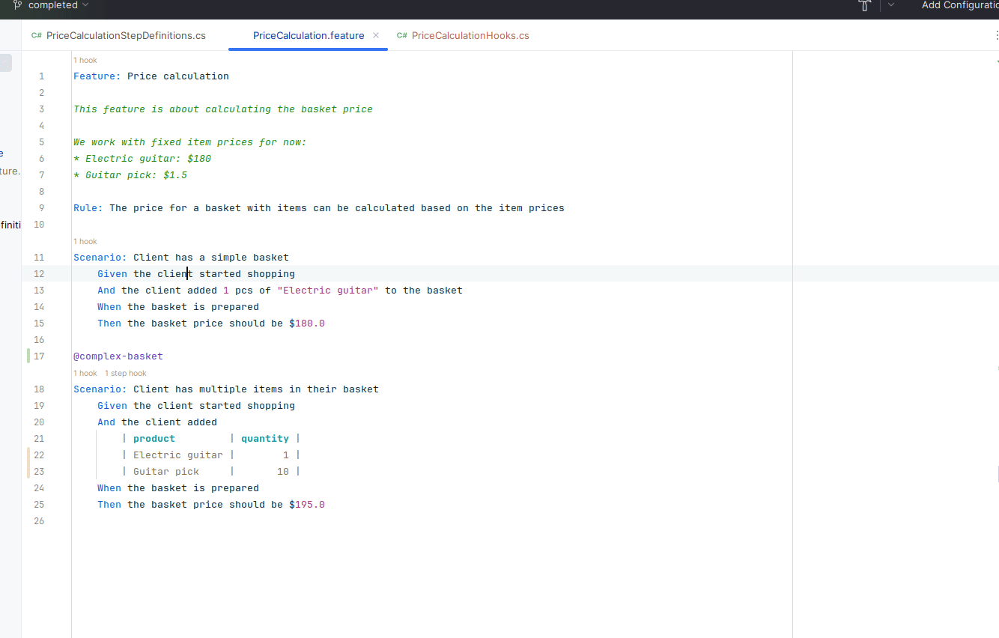

# Go to Step Definition

With the cursor on a step in a `.feature` file, **Go to Definition** (F12,
or Ctrl+Click / Cmd+Click) jumps to the matching `[Given]`/`[When]`/`[Then]`
method in the C# binding class. If more than one binding matches
(ambiguous), a picker lists the candidates.

:::{tab-set}

```{tab-item} Visual Studio
:sync: vs


```

```{tab-item} VS Code
:sync: vscode


```

```{tab-item} Rider
:sync: rider


```

:::
