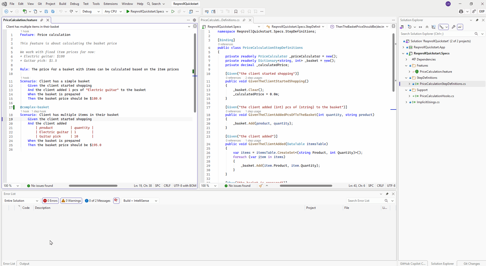
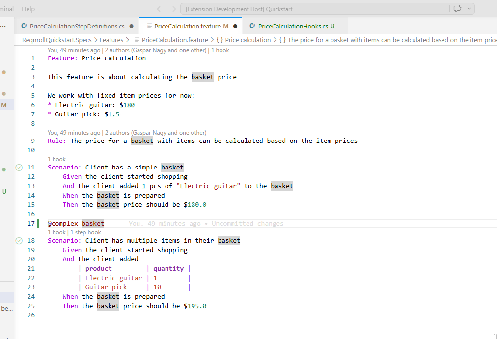

# Hook Navigation

**Go to Hooks**, invoked from a `.feature` file, lists the hook bindings in
scope at the cursor position, filtered by the tags and `[Scope]`
expressions that apply there:

* From a `Feature:` or `Scenario:` line: shows `[BeforeFeature]`/`[AfterFeature]`
  or `[BeforeScenario]`/`[AfterScenario]` hooks that apply.
* From a step line: additionally shows `[BeforeStep]`/`[AfterStep]` and
  `[BeforeStepBlock]`/`[AfterStepBlock]` hooks.

Selecting an entry navigates to the C# hook method.

:::{tab-set}

```{tab-item} Visual Studio
:sync: vs

Place the cursor in a `.feature` file, then right-click → **Go to Hooks**
(in the code editor context menu, next to "Go To Definition"). There's no
Extensions menu placement for this one — it's editor-context-menu only.


```

```{tab-item} VS Code
:sync: vscode

Place the cursor in a `.feature` file, then either:

- Right-click → **Reqnroll: Go to Hooks**, or
- Command Palette → **Reqnroll: Go to Hooks**.

No default keybinding.


```

```{tab-item} Rider
:sync: rider

Place the cursor in a `.feature` file, then either:

- Right-click → **Go to Hooks**, or
- **Tools → Reqnroll → Go to Hooks**.

No default keybinding.

TODO(media): 🎬 gif — short jump-to-hook interaction, invoking Go to Hooks
and selecting a result.
**Target:** `hook-navigation/hook-navigation-rider.gif`
```

:::

```{tip}
You don't always need to invoke this explicitly — [Code Lens](../editing-features/code-lens.md)
shows hook-match counts inline above `Feature:`/`Scenario:` lines while
you're reading the code, and clicking one opens the same picker filtered
to that lens's own hook set.
```

```{note}
If a `.feature` file is linked into more than one project, the hooks shown here always come from
the file's *home* project (wherever it physically lives on disk) — not necessarily the project
you opened it from. See [Troubleshooting](../troubleshooting.md#a-shared-feature-file-shows-hooks-diagnostics-or-highlighting-from-the-wrong-project).
```
