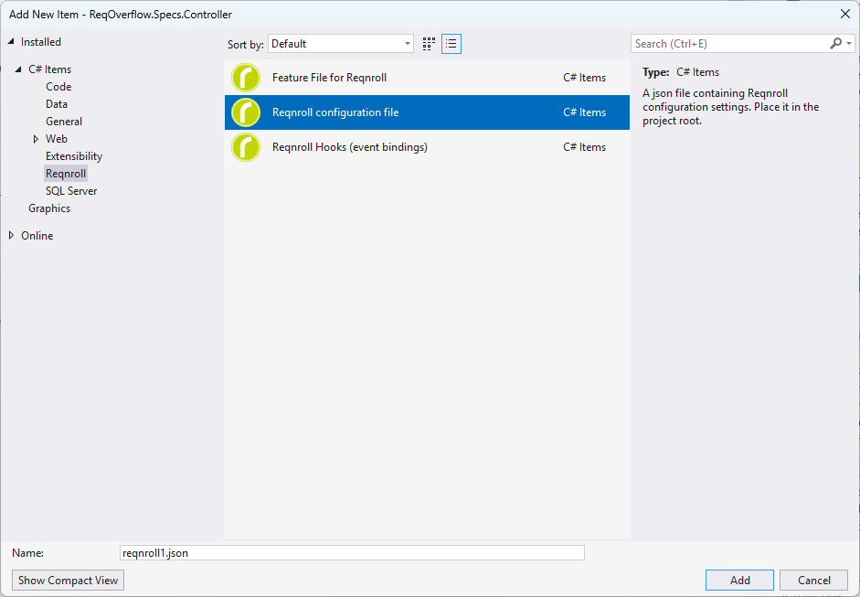
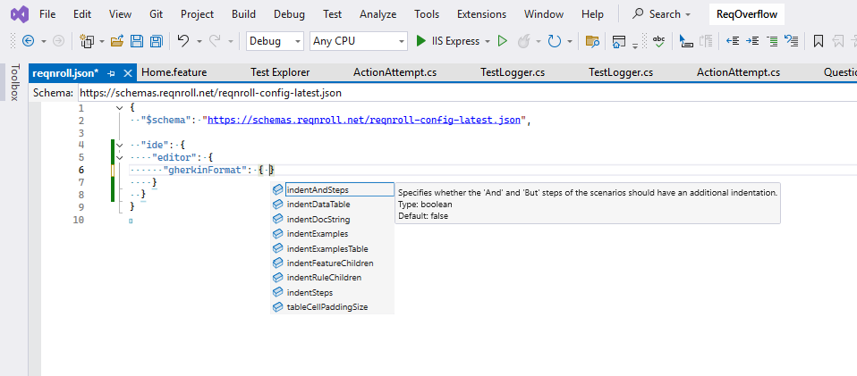

# Extension Settings

## `reqnroll.json` compatibility

Reqnroll IDE Support reads the same `reqnroll.json` schema as the existing
Reqnroll for Visual Studio extension — **no changes are needed** to an
existing config file. See the
[Reqnroll Configuration Reference](https://docs.reqnroll.net/latest/installation/configuration.html)
for the full settings schema outside the `ide` section; the `ide` section
itself — editor/formatting behavior, traceability tag links, binding
discovery overrides — is reproduced in full below (Visual Studio tab),
ported from the legacy extension's docs since it applies unchanged here.

## Per-IDE settings surface

Where you go to change a *host IDE* setting (as opposed to a Reqnroll
project setting in `reqnroll.json`) differs per IDE:

:::{tab-set}

````{tab-item} Visual Studio
:sync: vs

### Configuring via `reqnroll.json`

To change the extension's settings, edit the
[`reqnroll.json`](https://docs.reqnroll.net/latest/installation/configuration.html)
config file. If you don't have one, add it by right-clicking the Reqnroll
project → **Add → New Item... → Add Reqnroll configuration file**.



```{note}
Formatting behavior can also be controlled by an
[EditorConfig file](editorconfig.md).
```

The configuration file has a
[JSON schema](https://schemas.reqnroll.net/reqnroll-config-latest.json),
so you'll see all available properties as you start typing.



### The `ide` section of `reqnroll.json`

The `ide` section configures everything related to the IDE experience for
Reqnroll projects. It's extensible and lets you fine-tune your development
experience. For every other section of the config file, see the
[Reqnroll Configuration Reference](https://docs.reqnroll.net/latest/installation/configuration.html).

Four sub-sections are available within `ide`:

* [`editor`](#editor-section)
* [`traceability`](#traceability-section)
* [`reqnroll`](#reqnroll-section)
* [`bindingDiscovery`](#bindingdiscovery-section)

```{note}
You must build your project for changes in `reqnroll.json` to take effect.
```

**Example `ide` configuration:**

```json
"ide": {
  "editor": {
    "showStepCompletionAfterStepKeywords": true,
    "gherkinFormat": {
      "indentFeatureChildren": false,
      "indentSteps": true
    }
  },
  "traceability": {
    "tagLinks": [
      {
        "tagPattern": "issue:(?<id>\\d+)",
        "urlTemplate": "https://github.com/org/repo/issues/{id}"
      }
    ]
  }
}
```

(editor-section)=
#### `editor` section

Controls editor behaviors such as feature file formatting and code
completion.

| Setting | Type | Default | Purpose |
|---|---|---|---|
| `showStepCompletionAfterStepKeywords` | boolean | `true` | Enable/disable step completions after keywords (`Given`, `When`, etc.) |
| `gherkinFormat.indentFeatureChildren` | boolean | `false` | Indent children of `Feature` (`Background`, `Rule`, etc.) |
| `gherkinFormat.indentRuleChildren` | boolean | `false` | Indent children of `Rule` elements |
| `gherkinFormat.indentSteps` | boolean | `true` | Indent steps in scenarios |
| `gherkinFormat.indentAndSteps` | boolean | `false` | Extra indent for `And`/`But` steps |
| `gherkinFormat.indentDataTable` | boolean | `true` | Indent `DataTable` arguments |
| `gherkinFormat.indentDocString` | boolean | `true` | Indent `DocString` arguments |
| `gherkinFormat.indentExamples` | boolean | `false` | Indent `Examples` blocks |
| `gherkinFormat.indentExamplesTable` | boolean | `true` | Indent `Examples` tables |
| `gherkinFormat.tableCellPaddingSize` | integer | `1` | Padding for table cells, in spaces |
| `gherkinFormat.tableCellRightAlignNumericContent` | boolean | `true` | Right-align table cells that contain digits |

**Example:**

```json
"ide": {
  "editor": {
    "showStepCompletionAfterStepKeywords": true,
    "gherkinFormat": {
      "indentFeatureChildren": false,
      "indentSteps": true,
      "indentAndSteps": false,
      "tableCellPaddingSize": 1
    }
  }
}
```

(traceability-section)=
#### `traceability` section

Enables traceability settings for scenarios, such as linking scenario tags
to external issue trackers.

* `tagLinks` (array) — defines patterns for tags and the corresponding
  external URLs. Each entry:
  * `tagPattern` (string) — regex to match tag names, e.g.
    `"issue:(?<id>\\d+)"`.
  * `urlTemplate` (string) — URL template using captured regex groups,
    e.g. `"https://github.com/org/repo/issues/{id}"`.

**Example** — turns `@issue:1234` tags into clickable links to the
matching GitHub issue:

```json
"ide": {
  "traceability": {
    "tagLinks": [
      {
        "tagPattern": "issue:(?<id>\\d+)",
        "urlTemplate": "https://github.com/org/repo/issues/{id}"
      }
    ]
  }
}
```

(reqnroll-section)=
#### `reqnroll` section

```{note}
Specifying this section is only required for special cases when Reqnroll
is not configured via NuGet packages.
```

Handles project-level settings related to Reqnroll itself.

| Setting | Type | Default | Purpose |
|---|---|---|---|
| `isReqnrollProject` | boolean | *(auto-detect)* | Enables the project as a Reqnroll project |
| `configFilePath` | string | *(auto-detect)* | Path to `App.config` or `reqnroll.json` |
| `version` | string | *(auto-detect)* | Reqnroll version, e.g. `"2.3.1"` |
| `traits` | array | *(detected from NuGet packages)* | e.g. `"XUnitAdapter"`, `"MsBuildGeneration"`, `"DesignTimeFeatureFileGeneration"` |

(bindingdiscovery-section)=
#### `bindingDiscovery` section

```{note}
Specifying this section is only required for special cases when the
built-in binding discovery does not work.
```

Manages settings for discovering step bindings within the IDE.

* `connectorPath` (string) — file path to a custom binding connector. Can
  reference environment variables (e.g. `%ENV_VAR%`). Relative paths use
  the default connector folder as a base.
````

```{tab-item} VS Code
:sync: vscode

`.vscode/settings.json`, or the Settings UI, under the Reqnroll
extension's contributed settings.

TODO(media): 📷 screenshot — the VS Code settings UI, filtered to the
Reqnroll extension's contributed settings.
**Target:** `settings/settings-vscode.png`
```

```{tab-item} Rider
:sync: rider

**Settings → Languages & Frameworks → Reqnroll** (or the equivalent
Reqnroll settings page).

TODO(media): 📷 screenshot — the Rider settings page for Reqnroll.
**Target:** `settings/settings-rider.png`
```

:::
